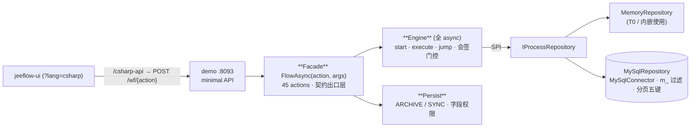

<div align="center">

# jeeflow-csharp

**jeeflow 工作流引擎的 C#/.NET 实现——多语言联邦第 8 语言**

[](https://www.nuget.org/packages/Mldong.Jeeflow.Facade)
[](https://www.nuget.org/packages/Mldong.Jeeflow.Core)
[](https://learn.microsoft.com/dotnet)
[](https://github.com/mldong/jeeflow-csharp/actions/workflows/release.yml)
[](./docs/testing.md)
[](./LICENSE)

</div>

[jeeflow](https://jeeflow-doc.mldong.com) 引擎规范的 **C#/.NET 语言实现**（多语言联邦，与
Java/Go/Python/Node/PHP/Rust/MoonBit 共享同一套 LogicFlow 流程 JSON 与契约规范）。
引擎核心**零第三方依赖**；MySQL 仓储走 MySqlConnector；持久化仅用 BCL `System.Data.Common`；**全链 async**。

统一门面入口 + 可插拔仓储 + 动态业务表入库；串行/并行/按比例会签与一票否决（ONE_VOTE_VETO）
语义对齐联邦契约（以 jeeflow-java 参考实现为准）。



## 包矩阵

| 包 | NuGet | 依赖 | 说明 |
|---|---|---|---|
| `Mldong.Jeeflow.Core` | [](https://www.nuget.org/packages/Mldong.Jeeflow.Core) | 零第三方 | 模型/SPI/引擎/parser/handler/event/枚举字典/内存仓储/雪花 id/出口 stringifier |
| `Mldong.Jeeflow.Repository.MySql` | [](https://www.nuget.org/packages/Mldong.Jeeflow.Repository.MySql) | Core、MySqlConnector | MySQL 仓储（全 async）、环境事务（AsyncLocal）、白名单分页/排序、建表 SQL 随包 |
| `Mldong.Jeeflow.Persist` | [](https://www.nuget.org/packages/Mldong.Jeeflow.Persist) | Core | 业务数据动态入库：DynamicTableWriter + ARCHIVE/SYNC 双模式 + 字段权限 |
| `Mldong.Jeeflow.Facade` | [](https://www.nuget.org/packages/Mldong.Jeeflow.Facade) | Core、Persist | `FlowAsync(action, args)` 45 action 统一门面 + `{code,msg,data}` 契约出口层 |

类库目标 `net8.0;net10.0` 双 TFM；demo/test 为 net10.0（不发布）。

## 快速开始

```bash
dotnet add package Mldong.Jeeflow.Facade    # 引入门面（传递 Core + Persist）
dotnet add package Mldong.Jeeflow.Repository.MySql   # 生产 MySQL 仓储（可选：内嵌场景用内存仓储即可）
```

### 内存仓储（内嵌 / 测试）

```csharp
using Mldong.Jeeflow.Core;

var repo = new MemoryRepository();
var ctx  = new ServiceContext(repo);
ctx.UserProvider = new MyUserProvider();          // IUserProvider：按 id 取用户

var engine = new JeeflowEngine(ctx);

// 部署流程（LogicFlow JSON）并发起
var content = File.ReadAllText("leave.json");
var define = new ProcessDefine { Name = "leave", DisplayName = "请假", Type = "approval",
                                 State = 1, Version = 1,
                                 Content = Encoding.UTF8.GetBytes(content) };
await repo.SaveDefineAsync(define);

var inst = await engine.StartProcessInstanceByIdAsync(define.Id, "user1",
    new FlowData { ["f_days"] = 3, ["f_reason"] = "年假" });
```

### MySQL 仓储（生产）

```csharp
using Mldong.Jeeflow.Repository.MySql;

var factory = MySqlConnectionFactory.FromEnv();   // 读 JEFFLOW_DB_HOST/PORT/USER/PWD/NAME（JEEFLOW_DB_* 别名兼容）
// 或显式： new MySqlConnectionFactory("192.168.1.160", 3306, "root", pwd, "jeeflow");
var repo = new MySqlRepository(factory);
var ctx  = new ServiceContext(repo);
repo.Configure(ctx);                              // 两阶段接线（ctx ↔ repo 解循环）
ctx.TransactionTemplate = new MySqlTransactionTemplate(factory, repo);  // 可选真事务
```

- 语句级 autocommit 为联邦现状；注入 `ITransactionTemplate` 后同事务内所有仓储方法共用同一连接/事务。
- 建表 SQL 随包：`schema/schema-mysql.sql`（5 张 `wf_*` 表，无自增，主键应用层雪花生成）。

### 统一门面（45 action）

```csharp
using Mldong.Jeeflow.Facade;

var facade = new JeeflowFacade(ctx);
var json = await facade.FlowJsonAsync("processInstance/startAndExecute", new FlowData
{
    ["processDefineId"] = "1",
    ["operator"] = "user1",
    ["f_days"] = 3,
});
// 恒 {code,msg,data} 信封；成功 code=0；业务失败只发明 99999999
```

集成方只需一个转发 controller：HTTP body JSON → `FlowData` → `FlowAsync(action, args)`。

## Demo 演示站（:8093）

```bash
dotnet run --project demo/Mldong.Jeeflow.Demo      # 双存储（默认内存；JEEFLOW_DEMO_STORE=mysql 连库）
bash demo/smoke_test.sh                            # T2 冒烟 20/20
```

- 路由：`/wf/{action}` catch-all + `/health` + `/stats` + `/reset`；CORS 全开，直连 [jeeflow-ui](https://github.com/mldong/jeeflow-ui)（前端 `?lang=csharp`，vite 代理 `/csharp-api → :8093`）。
- 种子流程与 java/go/python/node/php/rust/moon 七语言仓共享同一批 LogicFlow JSON（`flows/` 目录，随联邦漂移门禁逐字 diff）。

## 契约速览

- **信封**：恒 `{code,msg,data}`；成功 code=0；失败只发明 `99999999`；未知 action 同码。
- **出口**：id 全字符串化（递归含复数数组——雪花 id 超 float64 安全整数）、时间 `yyyy-MM-dd HH:mm:ss`、分页恒五键（`pageNum/pageSize/recordCount/totalPage/rows`）、统计计数 int 出参（issues/105）。
- **入口**：id string/number 双收、批量 `{ids}` 与单 `{id}` 双收（ids 优先）、`m_` 三段式查询过滤。
- **会签**：串行逐个推进（`operatorList_*/loopCounter_*/nrOfInstances_*` 任务变量）、并行全量/表达式门控（`#nrOfCompletedInstances`）、`ONE_VOTE_VETO` 一票否决、merged 后废弃残留 DOING、软拒绝 `submitType=20`。
- **事件**：`TASK_START` 落库后 fire（sourceId=taskId 可反查）、`CC_CREATE` 逐抄送人直传事件体、终态两路 `INSTANCE_END`、逐监听器隔离。
- **并发**：引擎命令级 `SemaphoreSlim` 串行化——同一任务并发办理恰一次成功。

## 测试

| 层 | 覆盖 | 运行 |
|---|---|---|
| T0 | 内存仓储 153 用例（契约 C1–C29 + CS 增补 + 负向变异） | `dotnet test tests/Mldong.Jeeflow.Tests` |
| T1 | MySQL 真库（分页/hydrate/事务回滚/并发恰一次/ARCHIVE/SYNC 字段权限/自清理） | `JEFFLOW_DB_PWD=... dotnet test --filter "Category=mysql-smoke"` |
| T2 | demo 冒烟 20 项 | `bash demo/smoke_test.sh` |
| 一致性 | stats 15 key 与七语言逐字段一致 | `dotnet run --project demo/Mldong.Jeeflow.Consistency` |

- MySQL 凭据只走 `JEFFLOW_DB_*` env，不入仓；开发机 `SKIP_MYSQL=1` 跳过 T1。
- 全链 async 门禁：`grep -rnE "\.Result|\.Wait\(\)|GetAwaiter\(\)\.GetResult\(\)" src/` 必须为空。

## 文档

| 文档 | 内容 |
|---|---|
| [docs/getting-started.md](docs/getting-started.md) | 安装 + 5 分钟上手 |
| [docs/engine-api.md](docs/engine-api.md) | 引擎五方法 + 聚合根行为 |
| [docs/flow-definition.md](docs/flow-definition.md) | 流程 JSON 定义规范 |
| [docs/spi-guide.md](docs/spi-guide.md) | SPI 实现指南（IUserProvider/表达式/handler） |
| [docs/persist.md](docs/persist.md) | 业务数据动态入库（ARCHIVE/SYNC/字段权限） |
| [docs/demo.md](docs/demo.md) | demo 站 + jeeflow-ui 联调 |
| [docs/contract-notes.md](docs/contract-notes.md) | 契约细节与已知差异注记 |
| [docs/action-manifest.json](docs/action-manifest.json) | 45 action 三方对账（java↔moon↔csharp） |
| [docs/testing.md](docs/testing.md) | T0/T1/T2 测试说明 |
| [docs/PUBLISH.md](docs/PUBLISH.md) | 发版执行清单（Trusted Publishing） |

## 发版

tag 驱动全自动：`git tag v1.0.x && git push` → GitHub Actions（Trusted Publishing，OIDC 免 API key）
→ pack 四包 → 按依赖拓扑序 push NuGet。版本号取自 tag（`v1.0.1 → 1.0.1`），仓库内不存任何密钥。

## 相关仓库

[java](https://github.com/mldong/jeeflow-java)（参考实现）· [go](https://github.com/mldong/jeeflow-go) · [python](https://github.com/mldong/jeeflow-python) · [node](https://github.com/mldong/jeeflow-node) · [php](https://github.com/mldong/jeeflow-php) · [rust](https://github.com/mldong/jeeflow-rust) · [moon](https://github.com/mldong/jeeflow-moon) · [ui](https://github.com/mldong/jeeflow-ui) · [文档站](https://jeeflow-doc.mldong.com)

## License

[Apache-2.0](./LICENSE)
